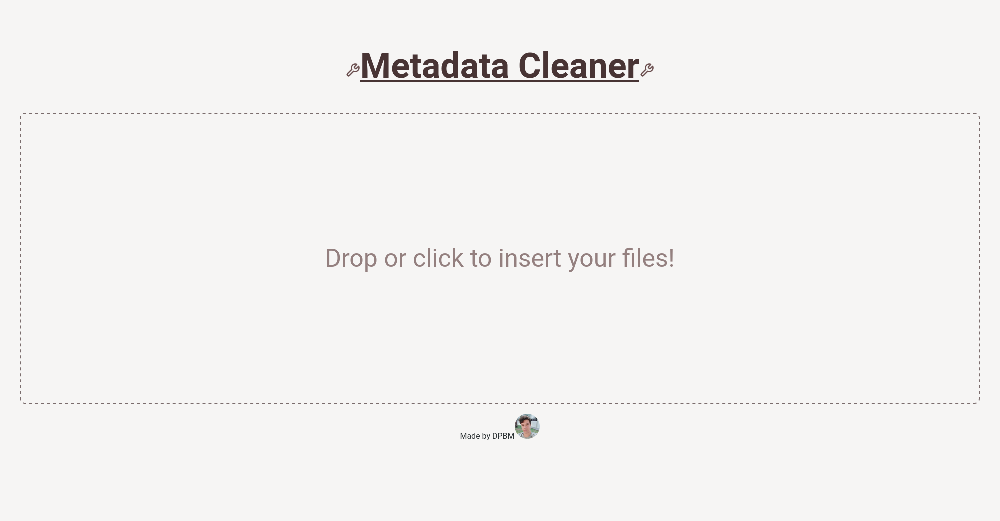

# Exif front-end



This is the front-end part of the exif remover project.

## requirements

you execute this project you need to install:

* [nodejs](https://nodejs.org/en)
* [npm](https://www.npmjs.com/) [or similar]
* the [backend](https://github.com/Dpbm/exif-backend) running somewhere

also, remember to set the `NEXT_PUBLIC_API_URL` environment variable in the `.env.local` file with the URL to your backend.

## run as dev

to run as dev, type:

```bash
npm install && npm run dev
```

## build the project

to build run:

```bash
npm install && npm run build
```

## access

With all done, you can access: `localhost:3000` and use the application.
